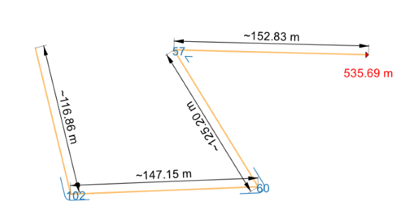

# BecaGIS Resources Sharing

BecaGIS Resources Sharing contains styles, scripts, models and other QGIS 
resources that can be shared with the [QGIS Resources Sharing](https://qgis-contribution.github.io/QGIS-ResourceSharing/).

## Collections

### Segment Measure

[**Segment Measure Polyline**](https://github.com/thangqd/BecaGIS-Resources/blob/main/collections/segment_measure/style/segment_measure_polyline.qml): automatically measure length of each segment, angle of each vertice, and total length and direction of polylines.

[**Segment Measure Polygon**](https://github.com/thangqd/BecaGIS-Resources/blob/main/collections/segment_measure/style/segment_measure_polygon.qml): automatically measure length of each segment, internal angles; perimeter and area of polygons.

### BecaGIS Icons

[**BecaGIS Icons**](https://github.com/thangqd/BecaGIS-Resources/tree/main/collections/becagis_icons/svg): BecaGIS SVG icons

