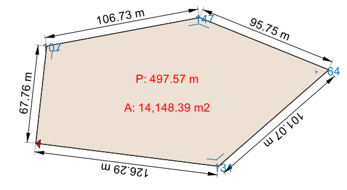

# HCMGIS Resources Sharing

This repository contains styles, scripts, models and other QGIS 
resources that can be shared with the [QGIS Resources Sharing](https://qgis-contribution.github.io/QGIS-ResourceSharing/).

## Collections

### Segment Measurements

[**Segment Measurements Polyline**](https://github.com/thangqd/HCMGIS-Resources/blob/main/collections/segment_measurements/style/segment_measurements_polyline.qml): automatically measure length of each segment, angle of each vertice, and total length and direction of polylines.

[**Segment Measurements Polygon**](https://github.com/thangqd/HCMGIS-Resources/blob/main/collections/segment_measurements/style/segment_measurements_polygon.qml): automatically measure length of each segment, internal angles; perimeter and area of polygons.

