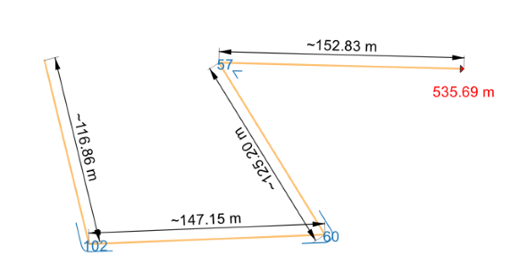

# HCMGIS Resources Sharing

This repository contains styles, scripts, models and other QGIS 
resources that can be shared with the QGIS Resources Sharing.

## Collections

[**Segment Polyline QML Style**](https://github.com/thangqd/HCMGIS-Resources/blob/main/collections/segments/style/Segment%20Polyline.qml): automatically measure length, angle of each segment and total length of polylines 

[**Segment Polygon QML Style**](https://github.com/thangqd/HCMGIS-Resources/blob/main/collections/segments/style/Segment%20Polygon.qml): automatically measure length, angle of each segment; perimeter and area of polygons 
